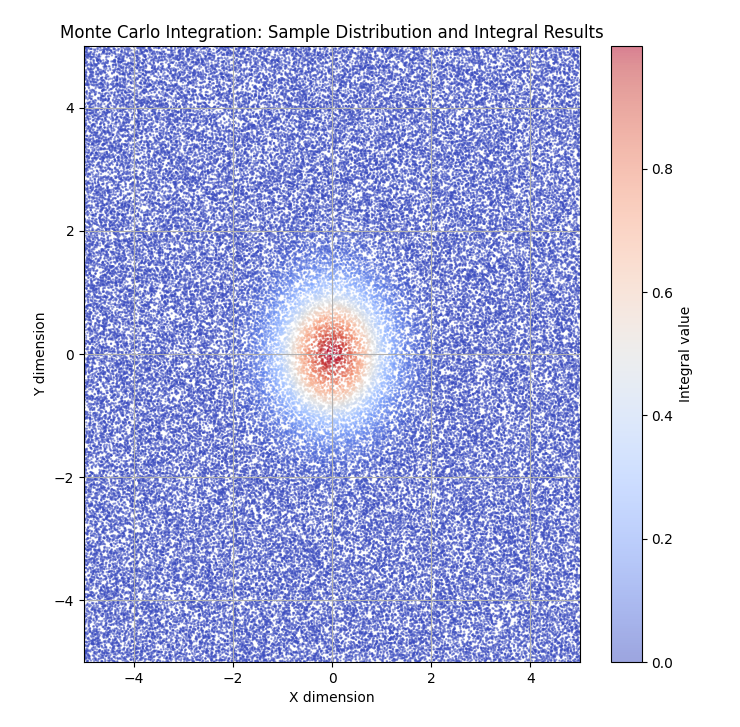

# Monte Carlo Integration with CUDA Acceleration



This repository contains Python code for performing Monte Carlo integration using GPU acceleration via CUDA and Numba. The code is designed for high-dimensional integrals and leverages GPU parallelism to efficiently compute integrals for arbitrary functions. Visualization of the sampling process and results is also included.

## Features
- **GPU Acceleration**: Utilizes Numba's CUDA JIT compiler to parallelize Monte Carlo integration on a GPU, significantly improving performance compared to CPU-based implementations.
- **High-Dimensional Integration**: Supports integration in arbitrary dimensions, allowing the user to specify both the number of dimensions and the corresponding bounds for the integral.
- **Custom Functions**: Allows users to integrate any custom function that can be expressed in Python and compiled for CUDA.
- **Real-Time Visualization**: Includes functions to visualize the sample points used during the Monte Carlo integration and the corresponding results.

## Requirements

To use this code, the following libraries are required:
- Python 3.x
- Numpy
- Matplotlib
- Numba with CUDA support
- CUDA-enabled GPU

Install these dependencies using the following command:
```
pip install numpy matplotlib numba
```

Ensure that you have a CUDA-enabled GPU and the necessary CUDA toolkit installed. The Numba documentation provides detailed instructions on setting up your environment: [Numba CUDA Installation](https://numba.pydata.org/numba-doc/latest/cuda/index.html).

## Monte Carlo Integration Algorithm

### Function: `monte_carlo_integration`

This function performs Monte Carlo integration of an arbitrary user-defined function over a specified multidimensional space. The integral is computed by evaluating the function at random sample points and then scaling the result by the volume of the integration domain.

#### Parameters:
- `func`: The function to be integrated. It must be defined for use on a GPU using Numba's `@cuda.jit(device=True)` decorator.
- `dim`: The number of dimensions of the integration.
- `bounds`: A list of tuples defining the bounds for each dimension. For example, `[(-1, 1), (-2, 2)]` defines a two-dimensional integration with the given bounds.
- `total_samples`: The total number of random samples used for the Monte Carlo integration (default: \(10^6\)).
- `batch_size`: The number of samples to be processed in each batch (default: \(10^5\)).

#### Returns:
- `integral`: The computed value of the integral.
- `samples_list`: A list of the samples used for integration.
- `results_list`: A list of the function evaluations at the sample points.

### Example:
```python
@cuda.jit(device=True)
def gaussian_function(x):
    total = 0.0
    for i in range(len(x)):
        total += x[i] ** 2
    return math.exp(-total)

dim = 2
bounds = [(-5, 5)] * dim
result, samples_list, results_list = monte_carlo_integration(gaussian_function, dim, bounds, total_samples=10**6, batch_size=10**5)
print(f"Calculated integral: {result}")
```

### Boundary Check and Error Handling:
- If `dim <= 0`, the function raises a `ValueError` indicating that the dimension must be greater than 0.
- If any element of `bounds` is not a tuple of two elements, a `ValueError` is raised.

## GPU Kernel Implementation

The code leverages CUDA GPU kernels to parallelize the function evaluation over multiple sample points. The key steps involve:
1. **Random Sampling**: Generating random sample points within the specified bounds.
2. **Function Evaluation**: Evaluating the function on the GPU at each sample point.
3. **Accumulation**: Accumulating the results across batches to compute the final integral.

The GPU kernel is launched using the following command:
```python
kernel[blocks_per_grid, threads_per_block](samples_device, results_device, dim)
```

Where `blocks_per_grid` and `threads_per_block` define the number of CUDA threads and blocks used to process the samples.

## Visualization

The function `visualize_samples` is provided to plot the distribution of samples and the corresponding integral results. The user can specify the fraction of samples to visualize, and the function supports plotting up to a maximum number of samples for performance reasons.

### Function: `visualize_samples`

#### Parameters:
- `samples_list`: A list of samples generated during the integration.
- `results_list`: A list of results corresponding to the sample points.
- `bounds`: The bounds of the integration domain.
- `sample_fraction`: Fraction of total samples to plot (default: `None`, which will plot all samples up to `max_samples`).
- `max_samples`: Maximum number of samples to plot (default: 50,000).

#### Example:
```python
visualize_samples(samples_list, results_list, bounds, sample_fraction=None, max_samples=100000)
```

This will generate a scatter plot of the sample points colored by the function evaluation results.

## Performance Considerations

The performance of this Monte Carlo integration depends on several factors:
1. **GPU Memory**: Ensure that the GPU has sufficient memory to handle the batch sizes used. Larger batches generally lead to faster integration but require more memory.
2. **Dimensionality**: As the number of dimensions increases, the number of samples required to achieve a given level of accuracy grows exponentially. Monte Carlo methods are well-suited for high-dimensional problems, but performance and accuracy may degrade in very high dimensions.
3. **Batch Size**: Adjusting the batch size can help balance GPU load and memory usage. A larger batch size typically reduces the overhead associated with launching the GPU kernel but requires more GPU memory.

## Future Work

- **Adaptive Sampling**: Implement adaptive sampling strategies to improve accuracy in regions where the integrand has higher variance.
- **Higher-Dimensional Visualizations**: Extend the visualization to support more than two dimensions, potentially using dimensionality reduction techniques for better interpretability.
- **Error Estimation**: Add error estimation for the Monte Carlo results to provide users with a confidence interval for the integral.

## License

This project is licensed under the MIT License. See the LICENSE file for more details.

## Acknowledgments

This project uses Numba's CUDA extension and would not have been possible without the extensive work of the Numba team in making GPU programming accessible in Python.

# CUDAを用いたモンテカルロ積分

このリポジトリは、CUDAとNumbaを用いてGPUで高速にモンテカルロ積分を実行するPythonコードを提供します。このコードは、高次元積分を効率的に計算するためにGPUの並列処理を活用し、サンプリング過程と結果の可視化もサポートしています。

## 特徴
- **GPUアクセラレーション**: NumbaのCUDA JITコンパイラを使用して、モンテカルロ積分をGPU上で並列化し、CPUベースの実装に比べて大幅に高速化します。
- **高次元積分のサポート**: 任意の次元数の積分をサポートし、ユーザーは次元数とそれに対応する境界を指定できます。
- **カスタム関数**: Pythonで記述された任意の関数をCUDA用にコンパイルして積分に利用可能です。
- **リアルタイム可視化**: モンテカルロ積分で使用されるサンプル点と結果の分布を可視化する機能を提供します。

## 必要条件

以下のライブラリが必要です:
- Python 3.x
- Numpy
- Matplotlib
- Numba (CUDA対応)
- CUDA対応GPU

これらの依存関係を以下のコマンドでインストールできます:
```
pip install numpy matplotlib numba
```

CUDA対応GPUおよび必要なCUDAツールキットがインストールされていることを確認してください。NumbaのドキュメントにCUDA環境の設定方法が記載されています: [Numba CUDA インストール](https://numba.pydata.org/numba-doc/latest/cuda/index.html)。

## モンテカルロ積分アルゴリズム

### 関数: `monte_carlo_integration`

この関数は、指定された多次元空間上で任意のユーザー定義の関数をモンテカルロ法で積分します。積分は、ランダムサンプル点で関数を評価し、その結果を積分領域の体積でスケーリングすることで計算されます。

#### 引数:
- `func`: 積分される関数。Numbaの `@cuda.jit(device=True)` デコレータを用いてGPUで使用可能にする必要があります。
- `dim`: 積分の次元数。
- `bounds`: 各次元の積分範囲を定義するタプルのリスト。例えば `[(-1, 1), (-2, 2)]` は、2次元積分の範囲を示します。
- `total_samples`: モンテカルロ積分に使用するサンプル点の総数（デフォルト: \(10^6\)）。
- `batch_size`: 各バッチで処理するサンプルの数（デフォルト: \(10^5\)）。

#### 戻り値:
- `integral`: 計算された積分値。
- `samples_list`: 積分に使用されたサンプル点のリスト。
- `results_list`: 各サンプル点で評価された関数値のリスト。

### 例:
```python
@cuda.jit(device=True)
def gaussian_function(x):
    total = 0.0
    for i in range(len(x)):
        total += x[i] ** 2
    return math.exp(-total)

dim = 2
bounds = [(-5, 5)] * dim
result, samples_list, results_list = monte_carlo_integration(gaussian_function, dim, bounds, total_samples=10**6, batch_size=10**5)
print(f"積分値：{result}")
```

### 境界チェックとエラーハンドリング:
- `dim <= 0` の場合、次元は1以上でなければならない旨の `ValueError` が発生します。
- `bounds` の各要素が2つの要素を持つタプルでない場合、 `ValueError` が発生します。

## GPUカーネル実装

このコードは、CUDA GPUカーネルを使用して関数評価を複数のサンプル点に並列化しています。主な処理ステップは以下の通りです:
1. **ランダムサンプリング**: 指定された境界内でランダムなサンプル点を生成します。
2. **関数評価**: 各サンプル点で関数をGPU上で評価します。
3. **累積**: 各バッチの結果を集計し、最終的な積分値を計算します。

GPUカーネルの起動は以下のコマンドで行います:
```python
kernel[blocks_per_grid, threads_per_block](samples_device, results_device, dim)
```

ここで `blocks_per_grid` と `threads_per_block` は、CUDAスレッドとブロックの数を定義します。

## 可視化

`visualize_samples` 関数を用いて、サンプル点の分布と対応する積分結果をプロットできます。プロットするサンプルの割合を指定でき、最大サンプル数を設定してパフォーマンスに配慮した可視化が可能です。

### 関数: `visualize_samples`

#### 引数:
- `samples_list`: 積分中に生成されたサンプル点のリスト。
- `results_list`: サンプル点に対応する関数評価の結果リスト。
- `bounds`: 積分領域の境界。
- `sample_fraction`: プロットするサンプルの割合（デフォルト: `None`、全サンプルを最大 `max_samples` までプロットします）。
- `max_samples`: プロットするサンプルの最大数（デフォルト: 50,000）。

#### 例:
```python
visualize_samples(samples_list, results_list, bounds, sample_fraction=None, max_samples=100000)
```

これにより、サンプル点の散布図と関数評価結果がプロットされます。

## パフォーマンスの考慮事項

モンテカルロ積分のパフォーマンスは、以下の要因に依存します:
1. **GPUメモリ**: 使用するバッチサイズに対応する十分なメモリがGPUにあることを確認してください。大きなバッチサイズは通常、積分速度を向上させますが、より多くのメモリを必要とします。
2. **次元数**: 次元が増えると、所定の精度を達成するために必要なサンプル数は指数関数的に増加します。モンテカルロ法は高次元問題に適していますが、非常に高次元の場合、パフォーマンスと精度が低下する可能性があります。
3. **バッチサイズ**: バッチサイズを調整することで、GPUの負荷とメモリ使用量のバランスを取ることができます。バッチサイズを大きくすると、GPUカーネルの起動にかかるオーバーヘッドが減りますが、より多くのGPUメモリが必要です。

## 将来の拡張

- **適応サンプリング**: 分散が大きい領域で精度を向上させるための適応サンプリング戦略を実装します。
- **高次元の可視化**: 2次元以上の積分に対応するため、次元削減技術を用いて可視化を拡張します。
- **誤差推定**: モンテカルロ積分結果に対する誤差推定機能を追加し、積分値の信頼区間を提供します。

## ライセンス

このプロジェクトはMITライセンスの下で提供されています。詳細はLICENSEファイルをご参照ください。

## 謝辞

このプロジェクトは、NumbaのCUDA拡張を利用しており、GPUプログラミングをPythonで可能にしたNumbaチームの貢献に依拠しています。
